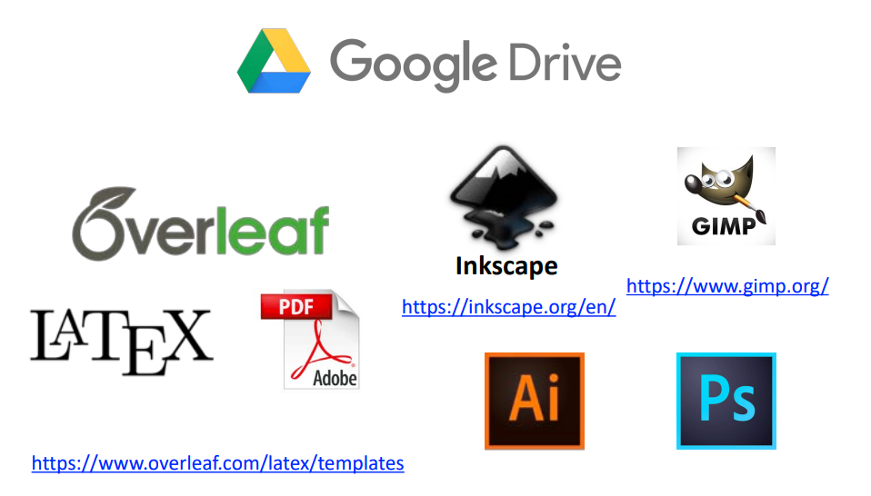

# Safe reinforcement learning for real-life applications 

 Goal: Having a solid understanding in the field of Reinforcement Learning(RL)  ==> Have some research background in the field of RL, either by publishing a paper in a high-impact conference/journal, or complete a Master Thesis with the topic related to this field ==> Get an summer internship position, [CA1531: Learning-based multi-agent motion planning](https://www.merl.com/internship/openings?ai=on&ml=on&ro=on) and DA1508: Safe reinforcement learning for real-life applications, at Mitsubishi Electric Research Laboratories!


Topic related to RL:

- Multi-Agent_Reinforcement_Learning(MARL)

- Safe reinforcement learning 


# Plan Outline

## Chap1 -- Intro: 

- history of RL(Reinforcement Leanring)
- Current Application
- Significance(covered in many papers)
- Promising futures


## Chap 2: Methodologies: 
- 2.1 Classical Algorithm and methods: and then we will have a quick overview of most classical and influential algorithms that people had invented in the past
- 2.2 SOTA Algorithm: Following, we will dive into some current most popular algorithms or methods that people had used to produce those SOTA(State of the art) results.

## Chap 3: Application: 

### 3.1 Realization of Algorithm: 
Then, we will dive into the detail of implementations, and try to apply those algorithms on certain senario and replicate their result. 


After having a solid understanding of the algorithms, and the capability to reproduce the result, it should be enough to make a story and showing them we have some experience and familiarity in this field, but might or might not be enough to fullfill the requirement of two JD(job description), CA1531: Learning-based multi-agent motion planning and DA1508: Safe reinforcement learning for real-life applications listed here, https://www.merl.com/internship/openings?ai=on&ml=on&ro=on.


> DA1508: Safe reinforcement learning for real-life applications, "The ideal candidate should have solid background in RL, e.g. CMDP, and RMDP theories. Knowledge of dynamical system theory and nonlinear control theory is a plus, but not a requirement. Publication of the results produced during the internship is anticipated, e.g., ICML, ICLR, NeurIPS."

==> "Solid Background" didn't not well defined, and they didn't explicitly mention the publication is a must.

> CA1531: Learning-based multi-agent motion planning, "The ideal candidate is enrolled in a PhD program in Electrical, Mechanical, Aerospace Engineering, Robotics, Computer Science or related program, with prior experience in multi-agent motion planning, machine learning (especially supervised, reinforcement, and safe ML), and convex and non-convex optimization. A successful internship will result in innovative methods for multiagent planning, in the development of well-documented (Python/MATLAB) code for validating the proposed methods, and in the submission of relevant results for publication in peer-reviewed conference proceedings and journals."

==> They mentioned their expected result, "innovative methods for multiagent planning, in the development of well-documented (Python/MATLAB) code for validating the proposed methods, and in the submission of relevant results for publication in peer-reviewed conference proceedings and journals" ==> But, they didn't explicitly mention the candidate must have publication in the field as well. 

==> I can see that a publication is sufficient for an "accepted", but not a necessity. I think they still want to open the possibility to those Master or Undergrad student who do not have publication, but being able to show some solid understand in those field. ==> So, I think that's my goal, being able to show my understanding. 

#### Resource For Implementation:

- [Robotic Systems](http://motion.cs.illinois.edu/RoboticSystems/) (draft) – covers a lot about modeling, motion planning, dynamics and control, and some math review
- OPEN SOURCE ROBOT SIMULATOR, [Webots](https://cyberbotics.com/#cyberbotics)
  - [Nodes and API Functions](https://cyberbotics.com/doc/reference/nodes-and-api-functions)


  ### 3.2. Improvement for Publication:

To show the understanding, I think I either should have a paper being published, or have a draft paper that is on the way of being published + some great demonstration of essential concept + some intriguing result/insight/analysis (So, a good interview will be critical!)

- Objective Category of this paper:

==> So, let's push it further and aiming at for a publication at [high-impact conferences/journals](https://blog.csdn.net/liz_Lee/article/details/107247831) (e.g., CoRL, ICLR, NeurIPS, ICML, UAI, RSS, ICRA, COLT, CDC, L4DC, CVPR, ICCV, ECCV, PAMI, IJCV, etc.), and that definitely will be enough to eliminate their concern.

First, we need to decided the type of paper we want to publish (At least, we should give them a reason to accept our paper right?)


#### Q: What is the difference between a research paper and a review paper? 

Q1: Research paper? Is that means I need to invent something that is really important and impactful? and making people believe my invention is useful to other scientist? ==> And, is that possible to be done in a year? ==> I feel it's very unlikely.

Q2: Review paper? ==> I heard some publication will accept some review paper, but I do not sure that boundary between "reject" and "accept", and I also do not sure if Chap2 will be enough for a Review paper.  Overall, I think this one is more doable given the amount of times that I have. (--> I imagine I will only have half year in getting the result, and another half year to analyze thhe result,  writing the report, and presentation all kinda stuff). 

- **Review Paper** vs **Research Paper**
  - Research Paper -- Invent a innocative algorithm that can be applied to certain field, and the result should be competitve to the current SOTA(not necessary outmatch them, but should outperform the traditional algorithm that invented in the past);
  - Review Article -- A comprehensive overview of current major works. (I saw most of paper has 70-80 pages)
  - Reference: 
    - [Q: What is the difference between a research paper and a review paper? ](https://www.editage.com/insights/what-is-the-difference-between-a-research-paper-and-a-review-paper)


==> So, it's more likely we are going to write an Review Paper!

However, there are several types of **review paper**:
> 1. A narrative review explains the existing knowledge on a topic based on all the published research available on the topic. 
> 2. A systematic review searches for the answer to a particular question in the existing scientific literature on a topic.
> 3. A meta-analysis compares and combines the findings of previously published studies, usually to assess the effectiveness of an intervention or mode of treatment.
> Review papers form valuable scientific literature as they summarize the findings of existing literature. So readers can form an idea about the existing knowledge on a topic without having to read all the published works in the field. Well-written review articles are popular, particularly in the field of medicine and healthcare. Most reputed journals publish review articles. However, you should check the website of the journal you wish to get published in to see if they accept such articles. If published in a good peer-reviewed journal, review articles often have a high impact and receive a lot of citations.
> If you are new to writing research papers, I would recommend taking this course designed exclusively for early career researchers: [An in-depth academic publishing course for young researchers.](https://upskill.researcher.life/product/course-an-in-depth-academic-publishing-course-for-young-researchers/44?utm_source=website&utm_medium=internal_related_reading&utm_campaign=qa)  -- [Q: What is the difference between a research paper and a review paper?](https://www.editage.com/insights/what-is-the-difference-between-a-research-paper-and-a-review-paper)

- Narrative Review paper: focus on certain challenge, analysis, provides more summarized and valuable scientific insight and analysis. Here is an example:

- [Haptic Feedback in Robot-Assisted Minimally Invasive Surgery](https://www.ncbi.nlm.nih.gov/pmc/articles/PMC2701448/), [[Paper link](https://www.ncbi.nlm.nih.gov/pmc/articles/PMC2701448/pdf/nihms-92282.pdf)]  ==> Because this paper mainly focuses on the explanation of technical challenges of creating haptic feedback to the surgeon and their evaluation result. ==> A narrative review explains the existing knowledge and provides more insight for other researchers.


- Systematic Review Paper: Just let’s see an example:

  - Prevalence of haptic feedback in robot-mediated surgery: a systematic review of literature, [[Paper link](https://link.springer.com/content/pdf/10.1007/s11701-017-0763-4.pdf)]  ==> The paper name clearly points out it’s a systematic review paper 

soft robotic sleeve for haptic feedback during robotic-assisted surgery


- Review paper: 
  - [Haptic Feedback in Robot-Assisted Minimally Invasive Surgery](https://www.ncbi.nlm.nih.gov/pmc/articles/PMC2701448/), [[Paper link](https://www.ncbi.nlm.nih.gov/pmc/articles/PMC2701448/pdf/nihms-92282.pdf)]  ==> Because this paper mainly focuses on the explanation of technical challenges of creating haptic feedback to the surgeon and their evaluation result. ==> A narrative review explains the existing knowledge and provides more insight for other researchers. 
  - Prevalence of haptic feedback in robot-mediated surgery: a systematic review of literature, [[Paper link](https://link.springer.com/content/pdf/10.1007/s11701-017-0763-4.pdf)] ==> The paper name clearly points out it’s a systematic review paper, so it's a review paper
- Research Journal Paper: 
  - [Application of Haptic Feedback to Robotic Surgery](https://www.liebertpub.com/doi/abs/10.1089/1092642041255441?casa_token=4SokfONIAEoAAAAA:dHKpLIxZw7urrIVC0uNSaNpcRHjM4x2ojc0Dpw38mYt3RHlMcEB9muVCseYkpE_vQXlgqWVNhA), [[Paper Link](https://www-liebertpub-com.ezproxy.bu.edu/doi/pdf/10.1089/1092642041255441)]==> I will say it's a journal research paper. But, it declared itself to be a technical report, and it only just proposed a hypothesis and not any original 
  - A Soft-Robotic End-Effector for Independently Actuating Endoscopic Catheters, [[Paper Link](https://mecheng.iisc.ac.in/~asitava/Ashwin-JMR-19-final.pdf)] ==> This paper provides original research on designing, modeling and testing a prototype endoscopic catheters

- Research Conference paper
  - [A Simple Electric Soft Robotic Gripper with High-Deformation Haptic Feedback ](https://ieeexplore.ieee.org/document/8794098), [[Paper link](https://ieeexplore-ieee-org.ezproxy.bu.edu/stamp/stamp.jsp?tp=&arnumber=8794098)] ==> This paper is published at 2019 International Conference on Robotics and Automation (ICRA) Conference, so...

#### Q: Journal VS Conference paper

Let’s just see some example:

- Journal Research Paper: Published on a journal
  - A Soft-Robotic End-Effector for Independently Actuating Endoscopic Catheters, [[Paper Link](https://mecheng.iisc.ac.in/~asitava/Ashwin-JMR-19-final.pdf)] ==> This paper provides original research on designing, modeling and testing a prototype endoscopic catheters
- Conference paper: Published on a conference

  - [A Simple Electric Soft Robotic Gripper with High-Deformation Haptic Feedback ](https://ieeexplore.ieee.org/document/8794098), [[Paper link](https://ieeexplore-ieee-org.ezproxy.bu.edu/stamp/stamp.jsp?tp=&arnumber=8794098)]==> This paper is published at the 2019 International Conference on Robotics and Automation (ICRA) Conference, so...

  - [Robotic Interface Controller for Minimally Invasive Surgery](https://ieeexplore.ieee.org/stamp/stamp.jsp?tp=&arnumber=8442048) ==> This one is directly searched from the IEEE International Conference website, so this should work.


# Learning Material(Book, Video, Tutorial, Paper, Online Courses, etc.)
---
Note: Here are a list of great resources that I had collected, and they will expedite my step for understanding this in the field of MARL.   


- Intro:
  - [来自DeepMind的深度强化学习大总结](https://blog.csdn.net/Mbx8X9u/article/details/78173539)
  - [CSDN 博客](https://so.csdn.net/so/search?q=reinforcement%20learning&t=&u=&utm_term=reinforcement%20learning&utm_medium=distribute.pc_toolbar_associateword.none-task-associate_word-opensearch_query-1-%3Cem%3Ereinforcement%3C%2Fem%3E%20learning.nonecase&depth_1-utm_source=distribute.pc_toolbar_associateword.none-task-associate_word-opensearch_query-1-%3Cem%3Ereinforcement%3C%2Fem%3E%20learning.nonecase&request_id=163203433916780269880564&opensearch_request_id=163203433916780269880564)
  - DeepMind – RL Course by David Silver - Lecture 1: Introduction to Reinforcement Learning, [[YouTube Video](https://www.youtube.com/watch?v=2pWv7GOvuf0&list=PLqYmG7hTraZDM-OYHWgPebj2MfCFzFObQ)], [[Website](https://www.davidsilver.uk/teaching/)]
  - CS 285 at UC Berkeley, Deep Reinforcement Learning, [[Slides](http://rail.eecs.berkeley.edu/deeprlcourse-fa20/)], [[Video](https://www.youtube.com/playlist?list=PL_iWQOsE6TfURIIhCrlt-wj9ByIVpbfGc)]
  - Steve Brunton
    - [Linear Algebra, 107 series of short 10 min video](https://www.youtube.com/watch?v=aHCyHbRIz44&list=PLMrJAkhIeNNRjxJ_sMtJ02geqw_-vuB7O&index=1)
    - [Control Bootcamp: Overview, 47 Series of 15-20 min vide](https://www.youtube.com/watch?v=Pi7l8mMjYVE&list=PLMrJAkhIeNNR20Mz-VpzgfQs5zrYi085m)
      - [Deep Reinforcement Learning: Neural Networks for Learning Control Laws](https://www.youtube.com/watch?v=IUiKAD6cuTA&list=RDCMUCm5mt-A4w61lknZ9lCsZtBw&start_radio=1&rv=IUiKAD6cuTA&t=26)
      - Deep Reinforcement Learning for Fluid Dynamics and Control

- Essential Concept/Methodologies: (Summarized in [Google Docs](https://docs.google.com/document/d/15fNROr4dFXfNl95aA0ONtwxhjZ_QwqlWTocAQEK65NE/edit?usp=sharing))
  - MDP(Markov Decision Process)
  - Q-learning
  - CMDP, and RMDP
  - Proximal Policy Optimization Algorithms, [[Github](https://github.com/nikhilbarhate99/PPO-PyTorch)], [[Paper](https://arxiv.org/abs/2006.15704)]


- Toolkits

  - fast.ai

    - What is it ==> fastai is a deep learning library which provides practitioners with high-level components that can quickly and easily provide state-of-the-art results in standard deep learning domains, and provides researchers with low-level components that can be mixed and matched to build new approaches. – More on their [paper](https://www.mdpi.com/2078-2489/11/2/108/htm)
    - How to get start ==> Read [here](https://docs.fast.ai/)
  - Dynamic Programming

    - 
- Book
  - [Reinforcement Learning: An Introduction (352 page)](https://web.stanford.edu/class/psych209/Readings/SuttonBartoIPRLBook2ndEd.pdf)
  - [Algorithms for Reinforcement Learning(98)](https://sites.ualberta.ca/~szepesva/papers/RLAlgsInMDPs.pdf)
- Paper
  - [2021] [Multi-Agent Reinforcement Learning: A Selective Overview of Theories and Algorithms](https://arxiv.org/pdf/1911.10635.pdf)
  - [2015] [A Comprehensive Survey on Safe Reinforcement Learning](https://www.jmlr.org/papers/volume16/garcia15a/garcia15a.pdf)
  - [Cooperative Multi-Agent Learning: The State of the Art](https://cs.gmu.edu/~lpanait/papers/panait05cmasl.pdf)
  - [Robust Constrained-MDPs: Soft-Constrained Robust
    Policy Optimization under Model Uncertainty](https://arxiv.org/pdf/2010.04870.pdf)


- Code repo
  - ==**Browse State-of-the-Art**==, [Multi-agent Reinforcement Learning](https://paperswithcode.com/task/multi-agent-reinforcement-learning)


- People
  - BU Calin Belta, 
    - Chuangchuang Sun, Xiao Li, Calin Belta, [Automata Guided Semi-Decentralized  Multi-Agent Reinforcement Learning](https://sites.bu.edu/hyness/publications/), American Control Conference (ACC), Denver, CO, USA, 2020
  - [Ashok Cutkosky](https://ashok.cutkosky.com/)
    - Dynamic Balancing for Model Selection in Bandits and RL, https://proceedings.mlr.press/v139/cutkosky21a.html


# Things to know for writing a Research Paper or Master Thesis

- **Finding research paper(文献搜索神器)**

  - [Connected paper](https://www.connectedpapers.com/) ==> Find and explore academic papers
  - [Google Scholar](https://scholar.google.com/) ==> Search and explore scholarly literature and their impact
  - high-impact conference/jounal: CoRL, ICLR, NeurIPS, ICML, UAI, RSS, ICRA, COLT, CDC, L4DC, CVPR, ICCV, ECCV, PAMI, IJCV, etc.

- **文献管理神器**

  - [Mendeley](https://www.mendeley.com/download-reference-manager) – It’s free
  - [PaperCube](https://support.papersapp.com/support/home) – Not free, $32 for student, and paid already. Includes Mobile, iPad, Desktop, Word, Chrome support.
  - [RefWorks](https://refworks.proquest.com/researcher/) – Haven’t Tried Yet, but seems like it can facilitate the paper searching and management work. Developed third party app at Google Docs, and Word.

- ##### 阅读神器

  - ==**[边写边搜](https://www.fir.ai/)**== – 方便做文献笔记，摘录（图像/段落/公式 都可以），总结，还提供有内置翻译，搜索，笔记管理和查阅， including Word Add-in
  - Adobe Acrobat DC

- **论文编辑神器**

  - [Overleaf Latex](https://www.overleaf.com/) – (拥有2000 多个模板，大大小小的conference, school thesis 都有涵盖，网上可以搜索Latex Table Generator, )
    - Introduction to Latex:
      - [Learn LaTeX in 30 minutes](https://www.overleaf.com/learn/latex/Learn_LaTeX_in_30_minutes) 
      - [Latex-Course](https://github.com/jdleesmiller/latex-course) – Slides for an introductory course on LaTeX. The slides and their LaTeX source code are provided in [this github repository](https://github.com/jdleesmiller/latex-course)
      - [LaTex Tutorial for Beginners Full Course](https://www.youtube.com/watch?v=fCzF5gDy60g) – 1hr 30min, Youtube Video ==> It’s real good, here is it’s [breakdown version](https://www.youtube.com/watch?v=KpDdBsxpAw4&list=PLQTQDG8nyMPjlHdquBvv6f745YSY2Jylb)
      - [A Quick Introduction to LaTeX](https://getreuer.info/tutorials/quick-intro-to-latex/index.html) – A short introduction article, including Basic Fonts, Styling, Math and Structure
      - [LaTeX Tutorial.pdf](https://www.cs.cornell.edu/courses/cs3110/2012sp/handouts/latex.pdf) –> 8 page intro, with installation and basic rules
    - Advanced Topic:
      - Writing algorithm and pseudocode in Latex, [[Math-linux.com](https://www.math-linux.com/latex-26/faq/latex-faq/article/how-to-write-algorithm-and-pseudocode-in-latex-usepackage-algorithm-usepackage-algorithmic)]
      - [Beamer Presentations: A Tutorial for Beginners (Part 1)—Getting Started](https://www.overleaf.com/learn/latex/Beamer_Presentations%3A_A_Tutorial_for_Beginners_(Part_1)%E2%80%94Getting_Started) – How to use Latex to make PPT, and here are some [examples](https://www.davidsilver.uk/wp-content/uploads/2020/03/intro_RL.pdf), and [Documentation](https://www.overleaf.com/learn/latex/Beamer)
  - [Quillbot](https://quillbot.com/) – 修改语法,论文润色,paraphrase 段落
  - [Linggle](https://linggle.com/) – 查询词组以及固定搭配, 举个栗子
    - 不知道problem前面用什么东西, try to search with ```v. the problem``` ==> 很多权威期刊的例句就会出现啦
    - 不确定 “consider ?about the situation” 这个用法, 那就打入 ```consider?about the situation``` ==> 发现一般就 consider the situation 这个用法
  - [Ludwif guru](https://ludwig.guru/) – 查询每个语法英语母语使用者的使用频率
  - [Do People Say](https://dopeoplesay.com/) – 语料库来自于Reddit, 帮助查询比较口语化的使用方法
  - [Ozdic.com](https://ozdic.com/) – 一个超级简洁的牛晶词典架设的线上词典，可用于单词用法查询（每个单词都清晰的列出了单词释义，常用近义词，固定搭配，和短语)

- **论文修改辅助神器**

  - [Grammerly](https://app.grammarly.com/) – … Everyone should already know, they have [tech blog](https://www.grammarly.com/blog/engineering/introducing-embrace/) and [developers’ API](https://developer.grammarly.com/), which not everyone know

- **论文引用工具**

  - [OSU APA cheatsheet](https://library.osu.edu/documents/research-services/OSUL_APA2012.pdf) 
  - [Citation Manager Comparison Chart for Ohio State Students](https://guides.osu.edu/ld.php?content_id=19211859)

  - [Purdue OWL(Online Writing Lab)](https://owl.purdue.edu/owl/purdue_owl.html) – All research and citation resources

- **Visualizing and Plotting Graph(论文画图神器)**

  - [Matplotlib tutorial](https://github.com/rougier/matplotlib-tutorial#introduction) – [Writing mathematical expressions](https://matplotlib.org/3.3.0/tutorials/text/mathtext.html)
  - 

- Bonus

  - [**如何与导师高效的沟通**(4 points)](https://www.xiaohongshu.com/discovery/item/609e0caf000000002103cc3e?xhsshare=WeixinSession&appuid=5fd02cc60000000001003a3e&apptime=1632503379)
    - 严格执行weekly meeting: 约定每周有固定的15-30min的meeting –> 成果总是有多有少的,但与导师之间的交流一定要有. 这对双方来说也起到了一个督促作用,起到了一个推进project进程和沟通效率的作用.
    - 准备meeting nodes/outline, 做到高效meeting: What to discuss during the meeting, Scrum principle: What you done last week? What you are working on? What plan to do next week? Any blocker? ==> 做好后, 如果是线上meeting, 提前发过去, share screen聊; 如果是线下meeting, 就打印两份带过去
    - meeting 结束后的会议纪要: 记录完后, 会议结束后的1-2hr内,给他发过去, 记录讨论了什么, 提出了什么问题, 解决了什么问题. ==> 因为会议结束后,一般都有其他的事要做,如果没有纪要的话,很可能就会忘了会议的讨论内容. ==> 这种情况的话就很尴尬, 如果问导师, 又不太好, 但不问的话,自己做什么又不是很清楚, 这meeting的作用就完全浪费了. ==> 而且这也使很好的给你和导师留个底; 给导师留下一个好的印象, 有个善始善终的条理性; 而且对双方也起到了一个督促的作用
    - 研究者心态: 抱着一个研究者的心态和老师交流.  把自己当成researcher, 把导师当成一个合作者, 讨论时不要以一种question-answering style进行, 而是要带着自己的观点, 提出自己的想法来讨论, 这种argue style conversation 才是不断推进整个项目和自己不断进步和提升的一种方式. 老师也是希望看到你有自己的想法, 然后积极的去和他讨论, 而不是他自己在那里输出像个TA一样

- **Reference**

  - [OSU Research Guides and Citation Help](https://guides.osu.edu/citation)
  - 小红书, Jessica又在吃饭 http://www.xiaohongshu.com/user/profile/5d3578f10000000011026e2a
  - [NCDD Dialogue and Deliberation resources Guide](https://ncdd.org/rc/beginners-guide/)


